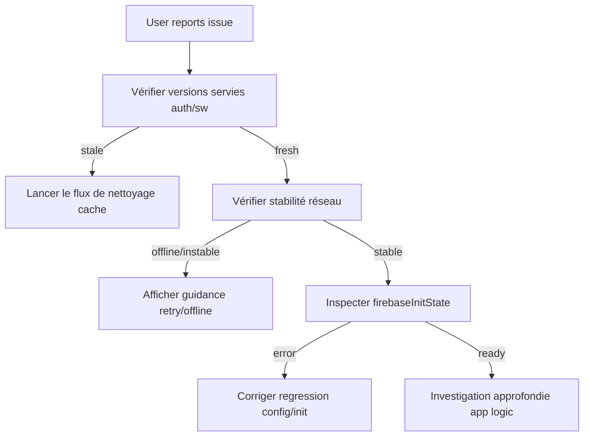

# PWA Incidents Runbook

Guide de diagnostic et résolution des incidents PWA en production.

---

## Schéma de décision



---

## Incident A — "Initialisation Firebase incomplète (cache PWA probable)"

### Symptômes
- Message affiché au login : "Initialisation Firebase incomplète"
- Diagnostic enregistré avec `stage: 'firebase_ready_check'`

### Cause racine
SW sert un ancien `index.html` qui charge des versions de scripts différentes de celles en cache → runtime mixte → Firebase SDK partiellement chargé.

### Diagnostic

1. **Vérifier les versions servies** :
   - Ouvrir DevTools > Network > recharger
   - Comparer `auth.js?v=N` avec la valeur attendue dans `index.html`
   - Vérifier `version.js` : `APP_VERSION` et `APP_BUILD` correspondent au deploy actuel ?

2. **Inspecter `__firebaseInitState`** :
   ```js
   // Dans la console
   JSON.stringify(window.__firebaseInitState, null, 2)
   ```
   - `status: 'error'` → le SDK ou la config n'a pas chargé
   - `status: 'booting'` → le SDK est encore en train de charger (timeout)
   - `status: 'ready'` mais erreur quand même → `window.db` ou `window.firebase` absent

3. **Consulter le diagnostic login** :
   ```js
   JSON.parse(localStorage.getItem('famresa_last_login_diag'))
   ```

### Résolution

**Côté utilisateur** :
1. Ajouter `?safe_mode=1` à l'URL → purge totale + reload
2. Si ça ne suffit pas : supprimer l'app/signet → purger données Safari/Chrome → relancer l'URL

**Côté dev** :
1. Vérifier que `version.js` a bien été incrémenté au dernier deploy
2. Vérifier que `APP_VERSION` dans `version.js` correspond au `CACHE_NAME` attendu dans le SW
3. Si divergence : corriger `version.js` et redéployer

---

## Incident B — Firestore unavailable / erreurs réseau

### Symptômes
- "Serveur indisponible — vérifiez votre connexion"
- "Vous êtes hors ligne — vérifiez votre connexion internet"
- "Erreur réseau — vérifiez votre connexion internet"

### Diagnostic

1. **L'utilisateur est-il offline ?**
   ```js
   navigator.onLine // false = offline
   ```
   → Si offline : comportement normal, le message est correct.

2. **Firestore est-il down ?**
   → Vérifier https://status.firebase.google.com
   → Si outage : attendre la résolution, aucune action nécessaire.

3. **Problème spécifique à un appareil ?**
   → Vérifier la collection Firestore `erreur` : filtrer par `userAgent` pour identifier des patterns (iOS spécifique, version Chrome, etc.)
   → Tester sur données mobiles (4G/5G) pour éliminer un problème de proxy/firewall d'entreprise.

### Résolution

| Cause | Action |
|---|---|
| Offline | Normal — message UX correct |
| Firestore outage | Attendre — pas d'action |
| Proxy/firewall | Demander à l'utilisateur de tester en 4G |
| Cache corrompu | `?safe_mode=1` ou purge manuelle |

---

## Incident C — Prompt d'installation absent

### Symptômes
- L'utilisateur ne voit pas la bannière d'installation (Android) ni le modal iOS.

### Diagnostic

1. **L'app est-elle déjà installée ?**
   ```js
   window.matchMedia('(display-mode: standalone)').matches
   // ou
   window.navigator.standalone // iOS
   ```
   → Si `true` : l'app est déjà en mode PWA, le prompt est masqué volontairement.

2. **Vérifier les flags localStorage** :
   ```js
   localStorage.getItem('famresa_pwa_install_accepted')   // '1' = accepted
   localStorage.getItem('famresa_pwa_install_dismissed')   // timestamp
   ```
   - Si `accepted='1'` mais pas en standalone → le `checkUninstallReset()` aurait dû clear. Vérifier que `pwa-install.js` est à jour.
   - Si `dismissed` récent (< 30 jours) → le prompt est en cooldown. Attendre ou :
     ```js
     localStorage.removeItem('famresa_pwa_install_dismissed')
     ```

3. **iOS spécifique** :
   - Doit être Safari natif. Chrome/Firefox/Edge sur iOS ne supportent PAS l'installation PWA.
   - Vérifier avec : `navigator.userAgent` doit contenir `Safari` sans `CriOS/FxiOS/OPiOS/EdgiOS`.

4. **Android spécifique** :
   - L'événement `beforeinstallprompt` ne se déclenche que si les critères PWA sont remplis :
     - HTTPS
     - Manifest valide (DevTools > Application > Manifest → pas d'erreurs)
     - SW enregistré et actif

### Résolution

| Cause | Action |
|---|---|
| Déjà installé | Normal — prompt masqué |
| LS_ACCEPTED bloqué | `localStorage.removeItem('famresa_pwa_install_accepted')` |
| LS_DISMISSED récent | Attendre 30j ou supprimer manuellement |
| iOS non-Safari | Informer l'utilisateur d'utiliser Safari |
| Critères PWA non remplis | Vérifier manifest + SW dans DevTools |

---

## URLs de debug utiles

| Outil | URL / Commande |
|---|---|
| Safe mode | Ajouter `?safe_mode=1` à l'URL de l'app |
| Debug auth | Ajouter `?debug_auth=1` ou `localStorage.setItem('famresa_debug_auth','1')` |
| Firebase status | https://status.firebase.google.com |
| Erreurs Firestore | Collection `erreur` dans la console Firebase |
| Diagnostic login | `JSON.parse(localStorage.getItem('famresa_last_login_diag'))` |
| Firebase init state | `window.__firebaseInitState` |
| SW state | DevTools > Application > Service Workers |
| Cache contents | DevTools > Application > Cache Storage |
